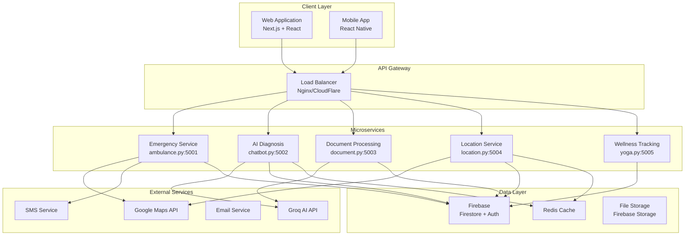
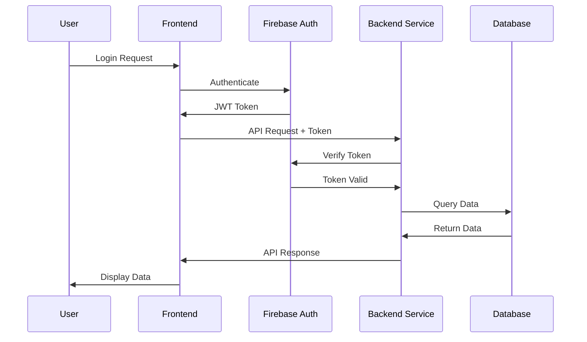
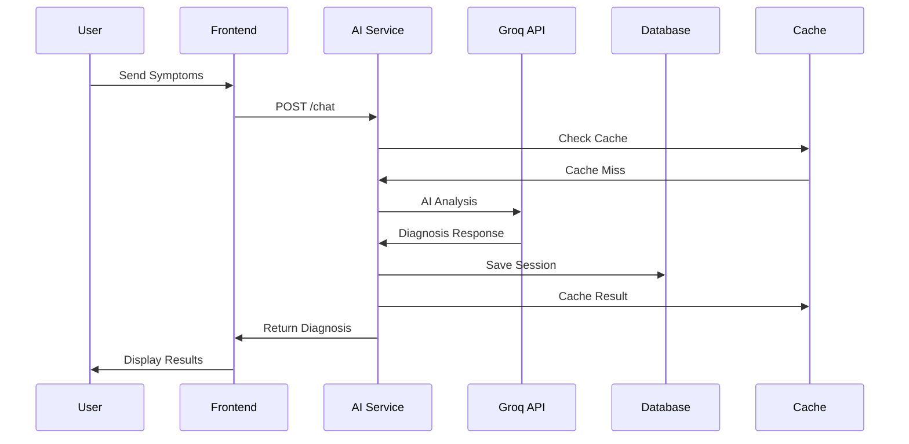
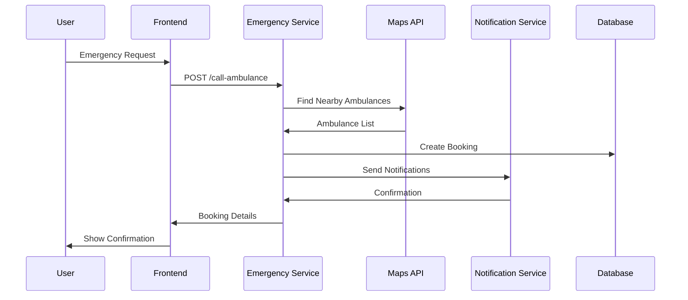

# Architecture Guide - Healthcare AI Agent

> **Comprehensive system architecture, design patterns, and technical decisions**

## Table of Contents

- [System Overview](#system-overview)
- [Architecture Patterns](#architecture-patterns)
- [Component Architecture](#component-architecture)
- [Data Flow](#data-flow)
- [Security Architecture](#security-architecture)
- [Scalability Design](#scalability-design)
- [Technology Stack](#technology-stack)
- [Deployment Architecture](#deployment-architecture)

## System Overview

Healthcare AI Agent follows a **microservices architecture** with a **React-based frontend** and **Flask-based backend services**. The system is designed for high availability, scalability, and maintainability.

### High-Level Architecture



## Architecture Patterns

### 1. Microservices Pattern

Each service is independently deployable and scalable:

| Service | Responsibility | Port | Technology |
|---------|---------------|------|------------|
| **Emergency** | Ambulance booking, emergency services | 5001 | Flask + Google Maps |
| **AI Diagnosis** | Medical consultation, symptom analysis | 5002 | Flask + Groq AI |
| **Document Processing** | Medical document analysis | 5003 | Flask + TensorFlow |
| **Location Services** | Doctor search, location services | 5004 | Flask + Google Places |
| **Wellness Tracking** | Yoga, fitness, pose detection | 5005 | Flask + OpenCV |

### 2. API-First Design

All services expose RESTful APIs with consistent patterns:

```python
# Standard API Response Format
{
    "success": boolean,
    "data": object,
    "error": {
        "code": string,
        "message": string,
        "details": object
    },
    "metadata": {
        "timestamp": string,
        "request_id": string,
        "version": string
    }
}
```

### 3. Event-Driven Architecture

Services communicate through events for loose coupling:

```python
# Event Publishing Pattern
class EventPublisher:
    def publish_event(self, event_type, data):
        event = {
            "type": event_type,
            "data": data,
            "timestamp": datetime.utcnow(),
            "source": self.service_name
        }
        # Publish to message queue or webhook
```

### 4. CQRS (Command Query Responsibility Segregation)

Separate read and write operations for better performance:

```python
# Command Handler (Write)
class EmergencyCommandHandler:
    def handle_ambulance_request(self, command):
        # Process emergency request
        # Update database
        # Publish event
        pass

# Query Handler (Read)
class EmergencyQueryHandler:
    def get_nearby_ambulances(self, query):
        # Read from optimized view
        # Return formatted data
        pass
```

## Component Architecture

### Frontend Architecture (Next.js)

```
src/
├── app/                    # App Router (Next.js 13+)
│   ├── (auth)/            # Route groups
│   │   ├── login/
│   │   └── register/
│   ├── dashboard/
│   ├── diagnosis/
│   ├── emergency/
│   └── layout.tsx
├── components/            # Reusable UI components
│   ├── ui/               # Base UI components
│   ├── forms/            # Form components
│   ├── charts/           # Data visualization
│   └── layout/           # Layout components
├── lib/                  # Utility libraries
│   ├── api.ts           # API client
│   ├── auth.ts          # Authentication
│   ├── utils.ts         # Helper functions
│   └── validations.ts   # Form validations
├── hooks/               # Custom React hooks
├── store/               # State management (Zustand)
└── types/               # TypeScript definitions
```

**Key Frontend Patterns**:

1. **Component Composition**:
```tsx
// Compound Component Pattern
<Card>
  <Card.Header>
    <Card.Title>Patient Information</Card.Title>
  </Card.Header>
  <Card.Content>
    <PatientForm />
  </Card.Content>
</Card>
```

2. **Custom Hooks**:
```tsx
// useAPI Hook
function useAPI<T>(endpoint: string) {
  const [data, setData] = useState<T | null>(null);
  const [loading, setLoading] = useState(false);
  const [error, setError] = useState<string | null>(null);
  
  // Implementation...
  return { data, loading, error, refetch };
}
```

3. **State Management**:
```tsx
// Zustand Store
interface AppState {
  user: User | null;
  setUser: (user: User) => void;
  clearUser: () => void;
}

const useAppStore = create<AppState>((set) => ({
  user: null,
  setUser: (user) => set({ user }),
  clearUser: () => set({ user: null })
}));
```

### Backend Architecture (Flask Services)

```
backend/
├── ambulance.py           # Emergency services
├── chatbot.py            # AI diagnosis
├── document.py           # Document processing
├── location.py           # Location services
├── yoga.py              # Wellness tracking
├── shared/              # Shared utilities
│   ├── auth.py         # Authentication middleware
│   ├── database.py     # Database connections
│   ├── cache.py        # Redis caching
│   ├── logging.py      # Logging configuration
│   └── validators.py   # Input validation
├── models/             # Data models
│   ├── user.py
│   ├── appointment.py
│   └── emergency.py
└── tests/              # Test suite
    ├── unit/
    ├── integration/
    └── fixtures/
```

**Key Backend Patterns**:

1. **Service Layer Pattern**:
```python
class EmergencyService:
    def __init__(self, db, maps_client, notification_service):
        self.db = db
        self.maps_client = maps_client
        self.notification_service = notification_service
    
    def book_ambulance(self, request_data):
        # Business logic
        # Data validation
        # External API calls
        # Database operations
        pass
```

2. **Repository Pattern**:
```python
class EmergencyRepository:
    def __init__(self, db):
        self.db = db
    
    def save_emergency_request(self, request):
        # Database operations only
        pass
    
    def find_nearby_ambulances(self, location, radius):
        # Query optimization
        pass
```

3. **Middleware Pattern**:
```python
def auth_required(f):
    @wraps(f)
    def decorated_function(*args, **kwargs):
        token = request.headers.get('Authorization')
        if not token or not verify_token(token):
            return jsonify({'error': 'Unauthorized'}), 401
        return f(*args, **kwargs)
    return decorated_function
```

## Data Flow

### 1. User Authentication Flow



### 2. AI Diagnosis Flow



### 3. Emergency Booking Flow



## Security Architecture

### 1. Authentication & Authorization

```python
# JWT Token Structure
{
    "sub": "user_id",
    "email": "user@example.com",
    "role": "patient|doctor|admin",
    "permissions": ["read:profile", "write:appointments"],
    "exp": 1642248000,
    "iat": 1642244400
}
```

**Security Layers**:
1. **Frontend**: Route guards, token management
2. **API Gateway**: Rate limiting, DDoS protection
3. **Services**: JWT validation, role-based access
4. **Database**: Row-level security, encryption

### 2. Data Protection

```python
# Data Encryption
class DataEncryption:
    def __init__(self, key):
        self.cipher = Fernet(key)
    
    def encrypt_pii(self, data):
        # Encrypt personally identifiable information
        return self.cipher.encrypt(data.encode())
    
    def decrypt_pii(self, encrypted_data):
        return self.cipher.decrypt(encrypted_data).decode()
```

### 3. API Security

```python
# Rate Limiting
from flask_limiter import Limiter

limiter = Limiter(
    app,
    key_func=get_remote_address,
    default_limits=["100 per hour"]
)

@app.route('/api/emergency')
@limiter.limit("10 per minute")
@auth_required
def emergency_endpoint():
    pass
```

### 4. Input Validation

```python
# Request Validation
from marshmallow import Schema, fields, validate

class EmergencyRequestSchema(Schema):
    patient_name = fields.Str(required=True, validate=validate.Length(min=2, max=100))
    phone_number = fields.Str(required=True, validate=validate.Regexp(r'^\+?1?\d{9,15}$'))
    location = fields.Dict(required=True)
    emergency_type = fields.Str(validate=validate.OneOf(['medical', 'trauma', 'cardiac']))
```

## Scalability Design

### 1. Horizontal Scaling

```yaml
# Kubernetes Deployment
apiVersion: apps/v1
kind: Deployment
metadata:
  name: ai-diagnosis-service
spec:
  replicas: 3
  selector:
    matchLabels:
      app: ai-diagnosis
  template:
    spec:
      containers:
      - name: ai-diagnosis
        image: healthcare/ai-diagnosis:latest
        resources:
          requests:
            memory: "512Mi"
            cpu: "250m"
          limits:
            memory: "1Gi"
            cpu: "500m"
```

### 2. Caching Strategy

```python
# Multi-Level Caching
class CacheManager:
    def __init__(self):
        self.redis = Redis()
        self.local_cache = {}
    
    def get(self, key):
        # L1: Local cache
        if key in self.local_cache:
            return self.local_cache[key]
        
        # L2: Redis cache
        value = self.redis.get(key)
        if value:
            self.local_cache[key] = value
            return value
        
        return None
```

### 3. Database Optimization

```python
# Connection Pooling
from sqlalchemy import create_engine
from sqlalchemy.pool import QueuePool

engine = create_engine(
    DATABASE_URL,
    poolclass=QueuePool,
    pool_size=20,
    max_overflow=30,
    pool_pre_ping=True
)
```

### 4. Load Balancing

```nginx
# Nginx Configuration
upstream backend {
    least_conn;
    server backend1:5001 weight=3;
    server backend2:5001 weight=2;
    server backend3:5001 weight=1;
}

server {
    listen 80;
    location /api/ {
        proxy_pass http://backend;
        proxy_set_header Host $host;
        proxy_set_header X-Real-IP $remote_addr;
    }
}
```

## Technology Stack

### Frontend Stack

| Technology | Purpose | Version |
|------------|---------|---------|
| **Next.js** | React framework | 13.5+ |
| **React** | UI library | 18.2+ |
| **TypeScript** | Type safety | 5.2+ |
| **Tailwind CSS** | Styling | 3.3+ |
| **Framer Motion** | Animations | 10.16+ |
| **Zustand** | State management | 4.4+ |
| **React Hook Form** | Form handling | 7.45+ |
| **Zod** | Schema validation | 3.22+ |

### Backend Stack

| Technology | Purpose | Version |
|------------|---------|---------|
| **Python** | Programming language | 3.8+ |
| **Flask** | Web framework | 2.3+ |
| **Gunicorn** | WSGI server | 21.2+ |
| **SQLAlchemy** | ORM | 2.0+ |
| **Marshmallow** | Serialization | 3.20+ |
| **Celery** | Task queue | 5.3+ |
| **Redis** | Caching/Message broker | 7.0+ |

### AI/ML Stack

| Technology | Purpose | Version |
|------------|---------|---------|
| **Groq** | LLM API | Latest |
| **TensorFlow** | ML framework | 2.13+ |
| **OpenCV** | Computer vision | 4.8+ |
| **NumPy** | Numerical computing | 1.24+ |
| **Pillow** | Image processing | 10.0+ |

### Infrastructure Stack

| Technology | Purpose | Version |
|------------|---------|---------|
| **Docker** | Containerization | 24.0+ |
| **Kubernetes** | Orchestration | 1.28+ |
| **Nginx** | Load balancer | 1.24+ |
| **Firebase** | Database/Auth | Latest |
| **Google Cloud** | Cloud platform | Latest |

## Deployment Architecture

### 1. Development Environment

```
Developer Machine
├── Frontend (localhost:3000)
├── Backend Services (localhost:5001-5005)
├── Firebase Emulator
└── Local Redis
```

### 2. Staging Environment

```
Staging Cluster
├── Load Balancer
├── Frontend (2 replicas)
├── Backend Services (2 replicas each)
├── Firebase (staging project)
├── Redis Cluster
└── Monitoring Stack
```

### 3. Production Environment

```
Production Cluster
├── CDN (CloudFlare)
├── Load Balancer (HA)
├── Frontend (3+ replicas)
├── Backend Services (3+ replicas each)
├── Firebase (production project)
├── Redis Cluster (HA)
├── Monitoring & Logging
└── Backup Systems
```

### 4. CI/CD Pipeline

```yaml
# GitHub Actions Workflow
name: Deploy Healthcare AI Agent

on:
  push:
    branches: [main]

jobs:
  test:
    runs-on: ubuntu-latest
    steps:
      - uses: actions/checkout@v3
      - name: Run Tests
        run: |
          npm test
          python -m pytest
  
  build:
    needs: test
    runs-on: ubuntu-latest
    steps:
      - name: Build Docker Images
        run: |
          docker build -t healthcare/frontend .
          docker build -t healthcare/backend .
  
  deploy:
    needs: build
    runs-on: ubuntu-latest
    steps:
      - name: Deploy to Kubernetes
        run: |
          kubectl apply -f k8s/
```

## Performance Considerations

### 1. Response Time Targets

| Service | Target | Acceptable |
|---------|--------|------------|
| Frontend Load | < 2s | < 5s |
| API Responses | < 200ms | < 500ms |
| AI Diagnosis | < 3s | < 10s |
| Document Processing | < 5s | < 15s |
| Emergency Booking | < 1s | < 3s |

### 2. Optimization Strategies

- **Code Splitting**: Lazy load components
- **Image Optimization**: WebP format, responsive images
- **API Optimization**: Pagination, field selection
- **Database Optimization**: Indexing, query optimization
- **Caching**: Multi-level caching strategy

### 3. Monitoring & Alerting

```python
# Health Check Endpoint
@app.route('/health')
def health_check():
    checks = {
        'database': check_database_connection(),
        'redis': check_redis_connection(),
        'external_apis': check_external_apis(),
        'memory_usage': get_memory_usage(),
        'cpu_usage': get_cpu_usage()
    }
    
    status = 'healthy' if all(checks.values()) else 'unhealthy'
    return jsonify({'status': status, 'checks': checks})
```

---

**Next Steps**: Review the [API Reference](./API_REFERENCE.md) for detailed endpoint documentation and [Deployment Guide](./DEPLOYMENT.md) for production setup.